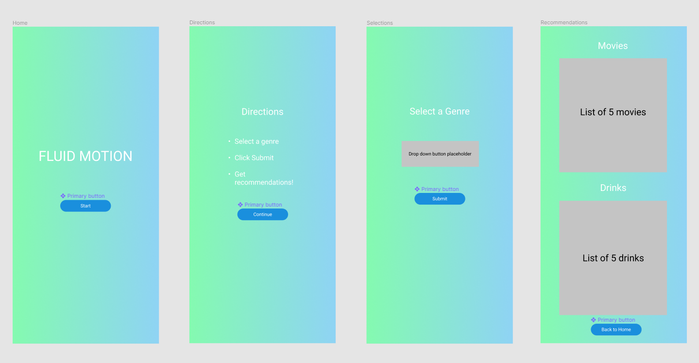
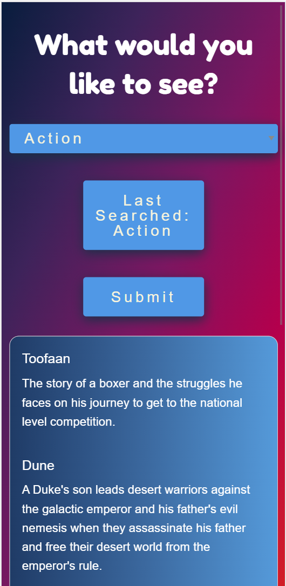

# Moving Picture Potions
Moving Picture Potions allows the user to view random movie selections and adult beverages based on their choice of a movie genre. The user's last genre choice is presented to the user for easy retrieval.

[Contributors](#contributors)

[Requirements](#requirements)

[User Story](#userStory)

[Wireframe](#wireframe)

[Technologies Used](#techUsed)

[Future Enhancements](#futurePlans)

[Moving Picture Potions Screenshot](#webImage)

[Moving Picture Potions URL](#projectURL)

---

## Contributors
* Ven Kim
* Anna Navales
* Julius Tovar
* Micah Lanham
* Brenda Jackels

---

## Requirements
* Use a CSS framework other than Bootstrap
* Be deployed to GitHub pages
* Be interactive
* Use at least two server-side APIs
* Does not use alerts, confirms, or prompts.
* Use client-side storage to store persistent data
* Be responsive
* Have a polished UI
* Have a clean repository that meets quality coding standards (file structure, naming conventions, follows best practices for class/id naming conventions, indentations, quality comments, etc)
* Have a quality README (description, technology used, screenshot, link to deployed application)
* Project added to each contributor's Module 2 portfolio

---

## User Story
As an indecisive movie watcher I want to choose a movie genre me and be shown 5 movie suggestions and 5 adult beverage suggestions. 

---

## Wire Frame

--- 

## Technologies Used
### **We used two server side APIs:**
* [IMDb API](https://english.api.rakuten.net/apidojo/api/imdb8/endpoints/)

* [TheCocktailDB](https://www.thecocktaildb.com/api.php)

### **We used Foundation for our framework**

### **The following languages were used:**
* HTML
* CSS
* JavaScript

--- 

## Future Enhancements
* Allow the user to choose a movie decade in addition to the genre
* Allow the user to save the results for future reference
* Include links for viewing the movies
* Link the beverages to the recipes for the beverages

---

## Moving Picture Potions Screenshot

## Moving Picture Potions URL
[Moving Picture Potions URL](https://micahlanham.github.io/Moving-picture-potions/)

